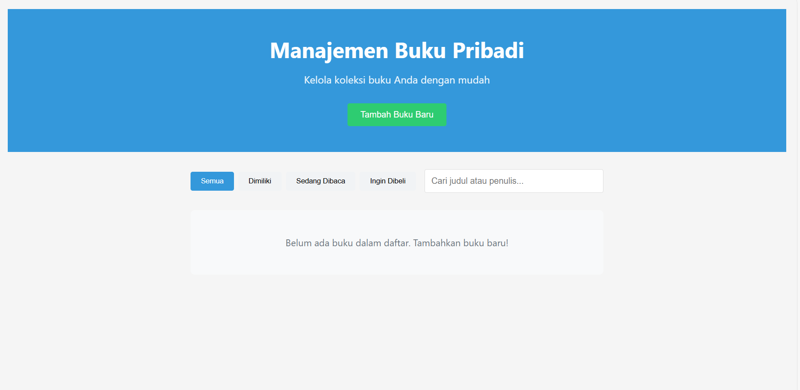
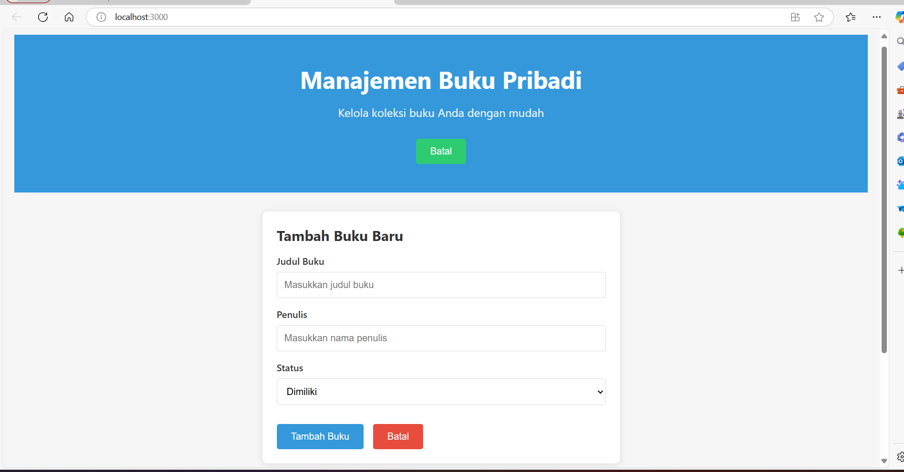

# 📚 Aplikasi Manajemen Buku Pribadi

Aplikasi ini dibuat menggunakan React untuk membantu pengguna mengelola daftar buku pribadi, seperti buku yang dimiliki, sedang dibaca, atau ingin dibeli. Cocok digunakan sebagai latihan atau tugas pengembangan aplikasi React dengan fitur lengkap.

---

## 📝 Deskripsi

Aplikasi ini memungkinkan pengguna untuk:
- Menambahkan data buku (judul, penulis, status)
- Menyunting dan menghapus buku
- Mencari dan memfilter buku berdasarkan status
- Melihat statistik buku
- Data tersimpan di localStorage agar tetap ada meski browser ditutup

---

## 🚀 Instalasi & Menjalankan Aplikasi

1. **Clone repositori**  
   ```bash
   git clone https://github.com/ichsank18/nama-repo.git
   ```

2. **Masuk ke folder proyek**  
   ```bash
   cd nama-repo
   ```

3. **Install dependencies**  
   ```bash
   npm install
   ```

4. **Jalankan aplikasi**  
   ```bash
   npm start
   ```

Aplikasi akan terbuka di browser pada `http://localhost:3000`.

---

## 🖼️ Screenshot Antarmuka

### Beranda / Manajemen Buku


### Statistik Buku


> Catatan: Buat folder `screenshots` lalu tambahkan gambar antarmuka di sana agar preview di GitHub muncul dengan benar.

---

## ⚛️ Fitur React yang Digunakan

- **Functional Components & Hooks**: Semua komponen dibuat menggunakan function + `useState`, `useEffect`, dll.
- **Context API**: Untuk manajemen state global buku.
- **Custom Hooks**:
  - `useLocalStorage`: Untuk menyimpan data di localStorage
  - `useBookStats`: Untuk menghitung statistik buku
- **React Router**: Navigasi antar halaman (Home & Statistik)
- **PropTypes**: Untuk type checking props
- **Testing**: Minimal 5 unit test dibuat menggunakan React Testing Library
- **Error Handling**: Validasi input pada form buku

---

## 📁 Struktur Folder 

```
src/
├── components/
│   ├── BookForm/
│   ├── BookList/
│   ├── BookFilter/
├── pages/
│   ├── Home/
│   └── Stats/
├── hooks/
│   ├── useLocalStorage.js
│   └── useBookStats.js
├── context/
│   └── BookContext.js
├── App.jsx
├── index.js
```

